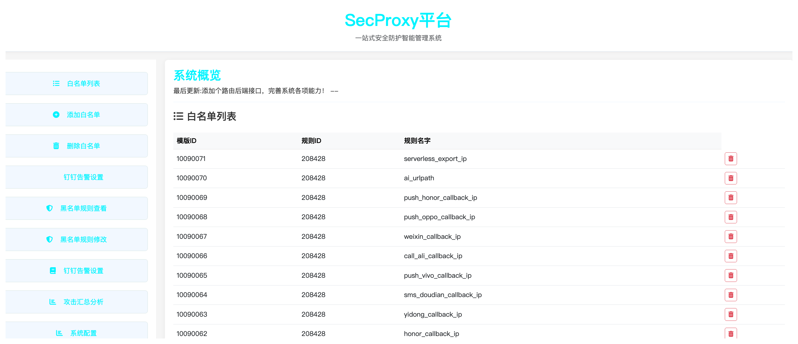
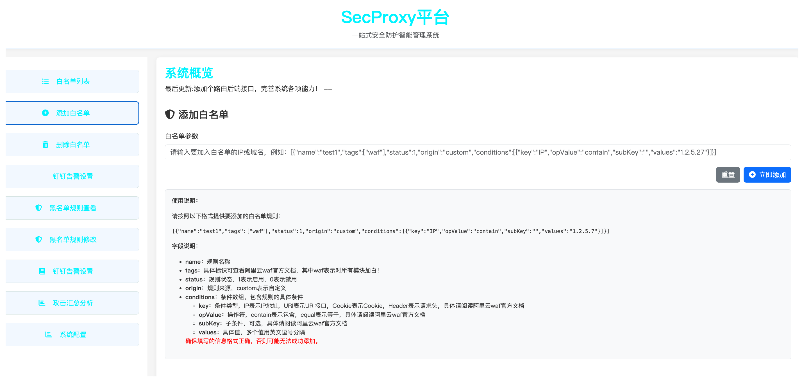
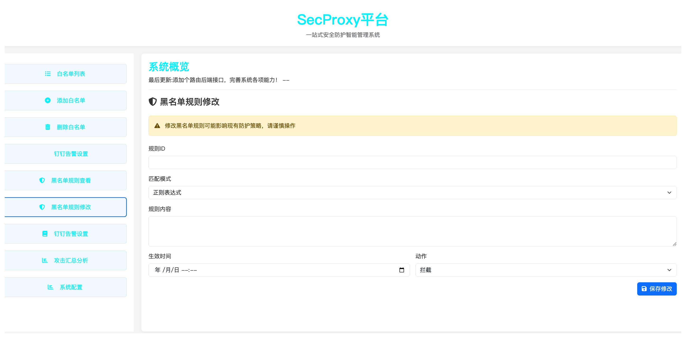

# SecProxy - 自动化安全协同平台
## 项目概述
SecProxy 是专为甲方安全人员设计的自动化安全协同平台，通过智能化、自动化的安全运营能力降低人工成本与资源消耗，提升安全响应效率。核心功能围绕阿里云 WAF 3.0 深度集成，实现拦截数据可视化、策略自动化管理及安全趋势分析。





## 技术栈
### 前端
- **语言/框架**：Python（数据处理）、HTML/CSS（页面渲染）
- **核心技术**：响应式布局、网格系统、AJAX 数据交互
- **架构设计**：清晰分层的页面结构，优化用户体验与功能扩展性

### 后端
- **语言/框架**：Python、Flask（Web 框架）、MySQL（数据库）
- **核心功能**：数据存储与处理、API 接口服务、安全策略逻辑实现
- **第三方库**：Flask-SQLAlchemy（数据库 ORM）、requests（网络请求）

## 架构设计
### 前端架构
- **Header**：固定顶部，展示平台名称与核心价值
- **Sidebar**：左侧固定宽度（1/5），包含功能菜单（如白名单管理、钉钉告警等）
- **Content Area**：主内容区根据菜单点击动态加载配置页面或数据报表，核心功能区采用网格布局展示卡片式模块（如攻击趋势、策略管理）
- **Footer**：底部单行版权信息

### 技术实现
- 使用原生 HTML/CSS 实现响应式布局，适配多终端
- 通过 AJAX 与后端 API 交互，动态渲染数据表格、图表（预留 ECharts 集成接口）

### 后端架构
#### API 设计
| 接口路径             | 功能描述               | 方法   | 响应格式          |
|----------------------|------------------------|--------|-------------------|
| /api/waf/blocked-ips | 获取前一天 WAF 拦截 IP 列表 | GET    | JSON              |
| /api/whitelist/add   | 一键添加白名单规则     | POST   | {"status": "success"} |
| /api/blacklist/remove| 一键解封 IP            | POST   | {"status": "success"} |
| /api/attack-trend    | 获取 IP 攻击趋势数据   | GET    | JSON 数组         |

#### 数据库模型（MySQL）
**IP 攻击趋势表 (attack_trend)**
| 字段名        | 类型          | 描述                 |
|---------------|---------------|----------------------|
| id            | INT(11)       | 自增主键             |
| timestamp     | DATETIME      | 攻击时间             |
| ip            | VARCHAR(45)   | 攻击 IP 地址         |
| attack_count  | INT(11)       | 攻击次数             |
| attack_ratio  | DECIMAL(5,2)  | 攻击占比（百分比）   |

## 核心功能
### 阿里云 WAF 3.0 集成
- **拦截数据可视化**：
  实时展示前一天 WAF 拦截 IP 详情（数量、分布、高频攻击源），支持按时间范围筛选，生成趋势折线图/柱状图。

- **自动化策略管理**：
  - **白名单**：通过模板快速添加信任 IP（支持单个/批量导入），数据格式示例：
    ```json
    [  
      {  
        "name": "test1",  
        "tags": ["waf"],  
        "status": 1,  
        "origin": "custom",  
        "conditions": [{"key": "IP", "opValue": "contain", "values": "14.22.5.27"}]  
      }  
    ]
    ```
  - **黑名单**：一键封禁恶意 IP，支持多维度条件（如来源 IP、请求频率），数据格式示例：
    ```json
    [  
      {  
        "action": "block",  
        "id": 20705051,  
        "name": "IpBlackList",  
        "remoteAddr": ["116.238.81.166", "183.223.240.178"]  
      }  
    ]
    ```

- **一键解封**：快速移除封禁策略，支持批量操作与操作日志审计。
- **智能告警**：通过钉钉 Webhook 自动推送拦截事件到指定群组，包含攻击 IP、时间、威胁等级等信息。
- **安全趋势分析**：基于历史数据生成 IP 攻击趋势报告，识别高频攻击时段与恶意 IP 集群，支持导出 CSV/Excel 格式，便于二次分析。

## 目录结构
```plaintext
aliwaf_sec/  
├── app.py             # Flask 主程序，后端服务入口  
├── config.py          # 配置文件（数据库连接、钉钉 Webhook 地址等）  
├── extensions.py      # 第三方库初始化（如数据库实例 db）  
├── models.py          # 数据库模型定义（表结构）  
├── routes/            # 路由模块（按功能划分）  
│   ├── __init__.py    # 蓝图初始化  
│   ├── waf.py         # WAF 相关 API 路由  
│   ├── user.py        # 用户管理 API 路由  
│   └── report.py      # 报告生成 API 路由  
├── requirements.txt   # 依赖库清单  
└── static/            # 前端静态资源（待扩展，当前暂未启用）  
    ├── css/  
    ├── js/  
    └── images/
```


## 部署指南
### 环境准备
安装 Python 3.8+ 及 pip：

#### 示例（Ubuntu/Debian）  
```
sudo apt-get install python3.8 python3-pip  
```
#### 安装依赖：
```
pip install -r requirements.txt 
``` 

#### 在 .env 中修改参数：
1. 复制.env-template文件为.env；
2. 完善里面的参数
#### 执行数据库迁移（使用 Flask-SQLAlchemy）：
```python
flask db init  
flask db migrate -m "Initial migration"  
flask db upgrade 
```
#### 启动服务
后端服务：
```
python app.py  
```

## 联系我们
微信：tomorrow_me-

持续优化中：更多功能（如其他云厂商 WAF 集成、日志分析）即将上线！